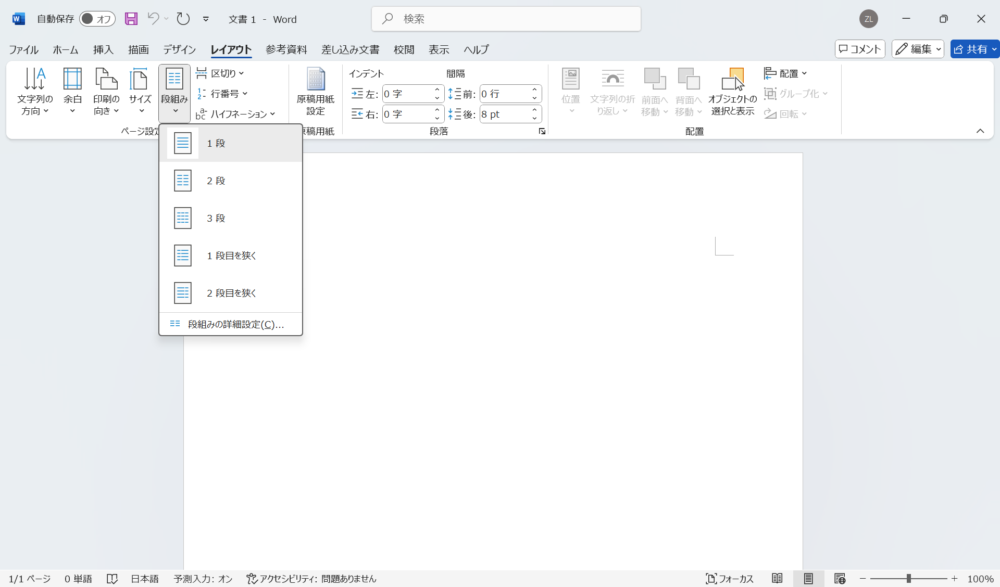

# レイアウトの設定

文字列の方向、用紙のサイズ、余白の設定などの文書レイアウトを設定するには「レイアウト」タブを選択します。

文字列の方向を変更するには、「レイアウト」タブから「ページ設定」グループにある「文字列の方向」を選択します。以下の図のように、「縦」、「横」が選択できます。

:::{figure} images/layout/word_layout.png
:label: word_layout
:alt: 文字列の方向
:width: 600px
:align: center

文字列の方向
:::

:::{figure-md} direction

文字列の方向
:::

「余白」を選択すると、以下の図のように余白の設定ができます。「標準」、「狭い」、「広い」などの既定の余白設定が用意されています。また、「ユーザー設定の余白」を選択すると、上下左右の余白を自由に設定できます。

:::{figure} images/layout/word_margin.png
:label: word_margin
:alt: 余白の設定
:width: 600px
:align: center

余白の設定
:::

:::{figure-md} margin

余白の設定
:::

「サイズ」を選択すると、以下の図のように用紙サイズの設定ができます。「A4」、「B5」、「A3」などの既定の用紙サイズが用意されています。

:::{figure} images/layout/word_paper_size.png
:label: word_paper_size
:alt: 用紙サイズの設定
:width: 600px
:align: center

用紙サイズの設定
:::

:::{figure-md} paper-size

用紙サイズの設定
:::

段組みとはページを複数の列に分けて文字をレイアウトすることです。「段組み」から「1段」、「2段」、「3段」などの段組みの設定ができます。通常は「1段」を選択しますが、新聞、雑誌などのように複数の段組みが必要な場合は、段組みの設定を変更します。

:::{figure} images/layout/word_column.png
:label: word_column
:alt: 段組みの設定
:width: 600px
:align: center

段組みの設定
:::

:::{figure-md} column

段組みの設定
:::